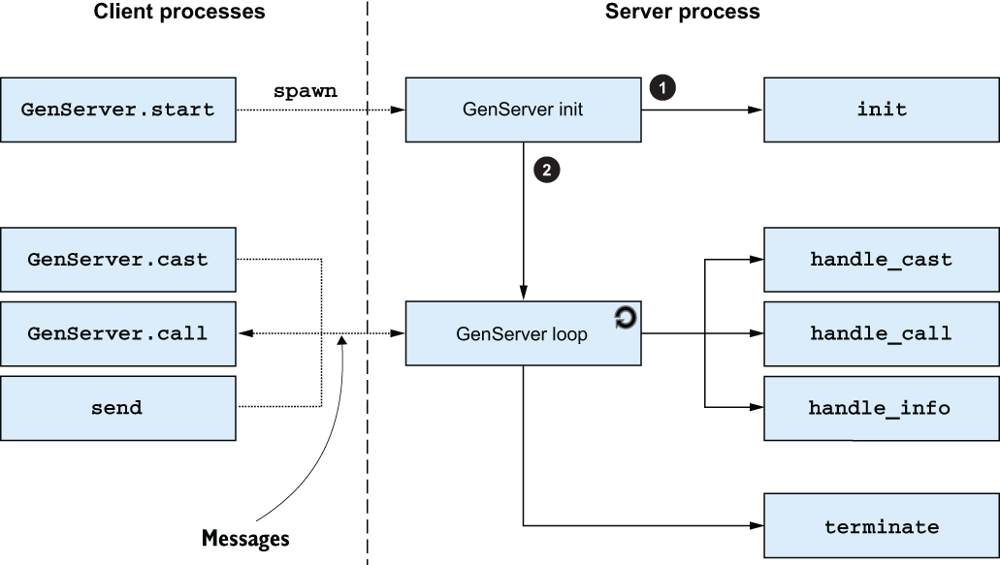

# generic server

The loop in `concurrency.md` is the same for every server: spawn, receive, handle, recurse with new state. A generic server is that machinery pulled out. You plug in a callback module for the parts that differ: initial state, and what each request does.

## ServerProcess

The generic module owns the process. The callback module is just data plus functions. Clients talk to the generic module, which calls back into the specific one when a decision is needed.

```elixir
defmodule ServerProcess do
  def start(callback_module) do
    spawn(fn ->
      initial_state = callback_module.init()
      loop(callback_module, initial_state)
    end)
  end

  def call(pid, request) do
    send(pid, {:call, self(), request})

    receive do
      {:response, response} -> response
    end
  end

  def cast(pid, request) do
    send(pid, {:cast, request})
  end

  defp loop(callback_module, state) do
    receive do
      {:call, caller, request} ->
        {response, new_state} = callback_module.handle_call(request, state)
        send(caller, {:response, response})
        loop(callback_module, new_state)

      {:cast, request} ->
        new_state = callback_module.handle_cast(request, state)
        loop(callback_module, new_state)
    end
  end
end
```

`start/1` takes a module. `init/0` builds the state. Each request is a term. `handle_call/2` returns `{response, new_state}`. `handle_cast/2` returns `new_state`. The loop never returns. Tail recursive, so the stack stays flat.

A store on top of that:

```elixir
defmodule KeyValueStore do
  def start, do: ServerProcess.start(__MODULE__)

  def put(pid, key, value), do: ServerProcess.cast(pid, {:put, key, value})
  def get(pid, key), do: ServerProcess.call(pid, {:get, key})

  def init, do: %{}

  def handle_cast({:put, key, value}, state), do: Map.put(state, key, value)

  def handle_call({:get, key}, state), do: {Map.get(state, key), state}
end
```

Clients call `KeyValueStore.get/2`. They never see `ServerProcess`. The callback module is both the interface and the implementation. That's the shape OTP uses too.

## behaviours

A behaviour is that split as a contract. The generic module drives the process. The callback module plugs in.

You declare the contract with `@callback`. You claim an implementation with `@behaviour`. `@impl` marks a function as a callback so the compiler checks the name and arity against the behaviour.

```elixir
@callback init() :: any
@callback handle_call(any, any) :: {any, any}
@callback handle_cast(any, any) :: any
```

`@impl ServerProcess` is better than `@impl true`. It names which behaviour the function belongs to. Wrong name or arity: compile warning. A callback you forgot: compile warning. 

The behaviour invokes. The callback decides.

## OTP behaviours

Erlang's standard library already has the generic pieces. Elixir wraps them:

- **GenServer** (`:gen_server`): stateful server process
- **Supervisor**: restart and recovery
- **Application**: components and libraries as startable units
- **GenEvent** (`:gen_event`): event handling
- **:gen_statem**: finite state machine in a server process

You will live in GenServer and Supervisor. The rest show up when you need them.

## GenServer

`GenServer` is OTP's `ServerProcess`. `use GenServer` sets `@behaviour GenServer` and injects default callbacks you can override.

```elixir
defmodule KeyValueStore do
  use GenServer

  def start, do: GenServer.start(__MODULE__, nil)

  def put(pid, key, value), do: GenServer.cast(pid, {:put, key, value})
  def get(pid, key), do: GenServer.call(pid, {:get, key})

  @impl GenServer
  def init(_), do: {:ok, %{}}

  @impl GenServer
  def handle_cast({:put, key, value}, state) do
    {:noreply, Map.put(state, key, value)}
  end

  @impl GenServer
  def handle_call({:get, key}, _from, state) do
    {:reply, Map.get(state, key), state}
  end
end
```

`GenServer.start(CallbackModule, init_arg)` returns `{:ok, pid}`. The second argument is what `init/1` receives. `init/1` returns `{:ok, state}`. Callbacks return tagged tuples so you can stop, set a timeout, or hibernate. `ServerProcess` didn't need that. GenServer does.

`handle_call/3` gets `from` (the caller) as well as the request and state. Reply with `{:reply, response, new_state}`. Cast has no caller waiting, so `{:noreply, new_state}`.

The process split:



Left side is the caller. Right side is the server process. `GenServer.start` spawns. The new process runs `init/1` in the callback module, then enters the GenServer loop. Casts, calls, and plain `send` all land in that loop. The loop dispatches:

- `GenServer.cast` → `handle_cast/2`
- `GenServer.call` → `handle_call/3`
- `send/2` → `handle_info/2`

When the process dies, `terminate/2` runs if you defined it and the process is trapping exits.

You talk to the process through the `GenServer` module. Don't send homemade `{:call, ...}` tuples. The wire format is OTP's, not yours.

## call vs cast

**Cast** is fire and forget. `GenServer.cast(pid, request)` sends and returns `:ok` immediately. No reply. No wait. If the server is dead, the message is dropped and the caller doesn't find out. Use it when you don't need a result.

**Call** is send and wait. `GenServer.call(pid, request)` sends, then blocks until a reply arrives, the timeout fires (default 5 seconds), or the server crashes. If the server dies mid-call, the caller exits too, unless it's trapping exits. Use it when you need a value, or when you need to know the request was handled.

The server still handles one message at a time. A slow `handle_call` blocks casts sitting in the mailbox. Cast means the caller doesn't wait.

`handle_info/2` is the escape hatch for everything that isn't a call or a cast: `send/2`, `:DOWN` messages, `Process.send_after/3`. Same return shape as cast: `{:noreply, new_state}`.

## summary

- A generic server is the shared machinery: the loop, the mailbox, the message protocol. The callback module is the specific part.
- A behaviour drives the process. Callbacks fire when the implementation has to decide.
- `GenServer` is OTP's generic server. Implement `init/1`, `handle_cast/2`, `handle_call/3`, `handle_info/2`. Mark them `@impl GenServer`.
- Talk to it through the `GenServer` module. Hide that behind your own interface functions.
- Cast: fire and forget. Call: send and wait for a reply, a timeout, or a crash.
